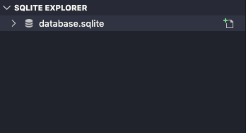

# Ecoleta API
Ecoleta é um projeto da [NVW](https://nextlevelweek.com/) entre os dias 01/06/2020 até 07/06/2020, sobre uma aplicação que interliga o usuário com instituições de coleta de materiais recicláveis.

## Como executar o projeto:
Utilize o node na versão 12.16.3

Efetue o clone do projeto:
```bash
git clone https://github.com/Architect42/ecoleta-api.git
```

Acesse a pasta do projeto e atualize as dependências do projeto com o comando:
```bash
npm install
```

Crie o banco de dados SQLite com suas respectivas tabelas:
```bash
npm run knex:migrate
```

Atualize os dados do banco que serão padrão em toda a aplicação:
```bash
npm run knex:seed
```

Comando para rodar a API:
```bash
npm run dev
```

## Para criar o banco de dados:
Digite no terminal:
```bash
npm run knex:migrate
```


## Para abrir o banco de dados:
Pressione no VS Code as teclas correspondente ao seu sistama operacional:

MacOs:
command + shift + P

Windows:
windows + shift + P

No menu que se abrirá, digite: <b>SQlite: Open Database</b> e precione a tecla enter.

Agora digite <b>Choose database from file</b> e vá até a pasta <b>src/database/database.sqlite</b>.



## Extensões do VS Code:
[SQLite](https://marketplace.visualstudio.com/items?itemName=alexcvzz.vscode-sqlite)