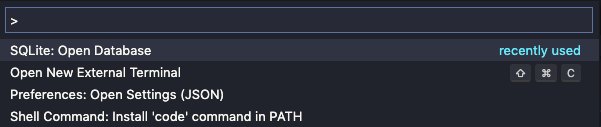
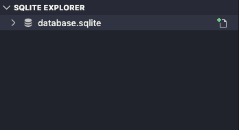
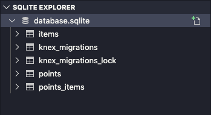
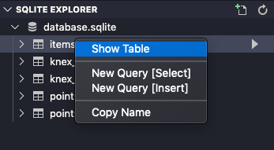
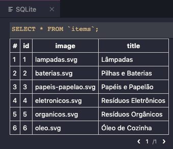

# Ecoleta API
Ecoleta é um projeto da [NVW](https://nextlevelweek.com/) entre os dias 01/06/2020 até 07/06/2020, sobre uma aplicação que interliga o usuário com instituições de coleta de materiais recicláveis.

## Como executar o projeto:
Utilize o node na versão 12.16.3

Efetue o clone do projeto:
```bash
git clone https://github.com/Architect42/ecoleta-api.git
```

Acesse a pasta do projeto e atualize as dependências do projeto com o comando:
```bash
npm install
```

Crie o banco de dados SQLite com suas respectivas tabelas:
```bash
npm run knex:migrate
```

Atualize os dados do banco que serão padrão em toda a aplicação:
```bash
npm run knex:seed
```

Comando para rodar a API:
```bash
npm run dev
```

## Configuração do banco de dados:
Para criar o banco de dados digite no terminal:
```bash
npm run knex:migrate
```

O comando acima irá criar uma base de dados local no projeto como o nome <b>database.sqlite</b> que pode ser econtrada no diretório <b>src/database</b>

Para popular o banco de dados com alguns dados default digite no terminal:
```bash
npm run knex:seed
```

## Para abrir o banco de dados:
Pressione no VS Code as teclas correspondente ao seu sistama operacional:

MacOs:
command + shift + P

Windows:
windows + shift + P

Este comando irá abrir um menu como na imagem abaixo.


No menu digite: <b>SQlite: Open Database</b> e precione a tecla enter.

No menu digite: <b>Choose database from file</b> e vá até a pasta <b>src/database/database.sqlite</b>.

Agora um novo menu irá aparecer no canto inferior esquerdo da tela com o nome <b>SQLITE EXPLORER</b>


Clique sobre o item <b>database.sqlite</b> ele deve aparecer mais ou menos assim, como mostra a imagem abaixo.


Para visualizar os dados de uma tabela clique com o botão direito do mouse sobre a tabela e selecione a opção <b>Show Table</b>, como mostra a imagem abaixo. <br>


No canto superior direito da tela irá abrir um nova aba com os dados da tabela, como mostra a imagem abaixo.


## Informações adicionais do projeto
Celebrate responsável por válidar os campos de requisições a API.
[celebrate](https://www.npmjs.com/package/celebrate)

## Extensões do VS Code:
[SQLite](https://marketplace.visualstudio.com/items?itemName=alexcvzz.vscode-sqlite)

## Extensões do Google Chrome:
É uma extensão do Chrome para impressão de JSON e JSONP.
[JSON Viewer](https://chrome.google.com/webstore/detail/json-viewer/gbmdgpbipfallnflgajpaliibnhdgobh?hl=pt-BR)